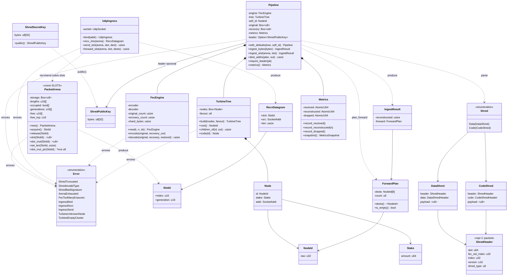
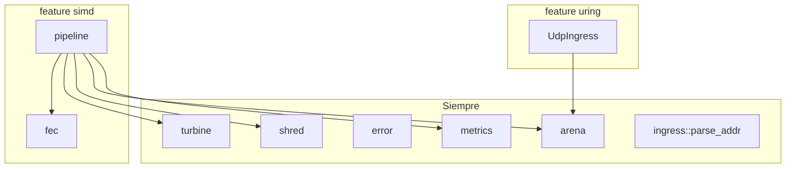

# Diagrama de clases — tipos del crate

Relaciones entre structs/enums públicos (y los internos de ingress relevantes). Rust no es OOP: “clase” aquí = tipo con API y composición.

## Dependencias por feature

## Notas

- `Pipeline` **posee** el `TurbineTree` (move en `with_defaults`).
- `FecEngine` del pipeline **no** es el temporal de `debug_udp` (ese se crea solo para rellenar `r0` de demo).
- Payload de `Shred` es un **préstamo** (`&[u8]`) sobre el slot, no un dueño.
