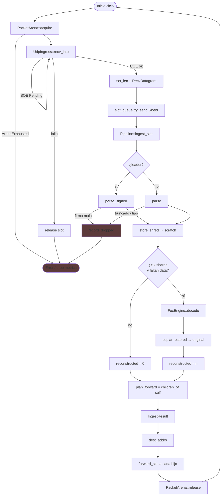
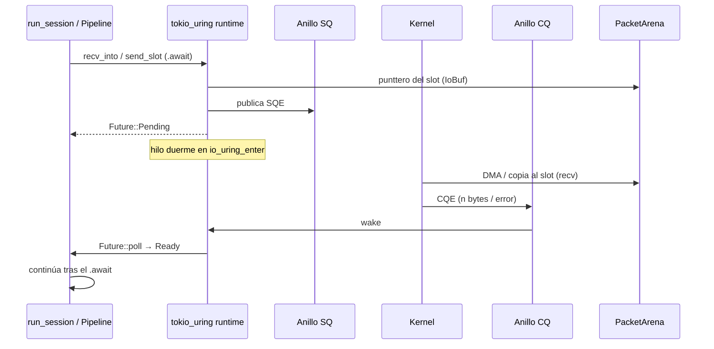

# Diagrama de flujo — procesos

Dos flujos: el **camino de producción** (loop mental del validador) y la sesión **`--debug-udp`**.

---

## 1. Ingestión de un shred (producción)



### Decisiones clave

| Punto | Criterio |
| --- | --- |
| Firma | Solo si `require_leader(pk)` |
| Reconstruct | `present ≥ k` y al menos un data faltante |
| Forward | Hijos del `self_id` en el heap k-ario; hoja → plan vacío |
| Métricas | `received` siempre; `dropped` si `Err`; `reconstructed` suma shards restaurados |

---

## 2. Sesión `--debug-udp` (loopback documentado)

```mermaid
flowchart TD
    Start([cargo run -- --debug-udp]) --> Main[main → wants_debug_udp]
    Main --> StartUring[tokio_uring::start]
    StartUring --> Fut[Future: run_session]

    Fut --> BindHijos[bind child_a, child_b std]
    BindHijos --> BindIng[UdpIngress::bind :0]
    BindIng --> Addr[ingress_addr = local_addr]
    Addr --> Build[tree::build 3 nodos fanout 2]
    Build --> Pipe[Pipeline::with_defaults self=1]

    Pipe --> Enc[encode_data shred d0]
    Enc --> Client[client.send_to → ingress_addr]
    Client --> Recv[recv_into → slot]
    Recv --> Ingest[ingest_slot]
    Ingest --> Dest[dest_addrs → addr_a, addr_b]
    Dest --> Fwd[forward_slot × 2]
    Fwd --> CheckA[child_a.recv_from == slot]
    CheckA --> CheckB[child_b.recv_from == slot]
    CheckB --> Mets[imprimir métricas]
    Mets --> Rel[release slot]
    Rel --> Ok([debug-udp ok])

    style Fut fill:#2a3f5c
    style Recv fill:#2a4a3a
    style Fwd fill:#2a4a3a
```



### Roles en el demo

```text
        client (no es nodo del árbol)
                 │ send_to
                 ▼
        nodo 1 = UdpIngress (raíz, stake 100)
               / \
        nodo 2   nodo 3
      child_a   child_b
```

---

## 3. Ciclo de un `.await` uring (detalle)



SQE = *Submission Queue Entry* (pedido). CQE = *Completion Queue Entry* (resultado).
