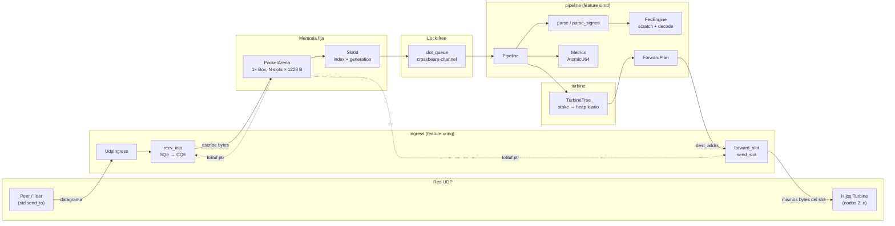

# Flujograma — arquitectura del pipeline

Vista de extremo a extremo: un shred entra por UDP, vive en un slot de arena y sale hacia los hijos del árbol Turbine **sin clonar el payload**.



## Lectura rápida

1. **Peer** manda un datagrama al socket uring.
2. **`recv_into`** hace `acquire` + SQE; el kernel escribe en el slot.
3. Se pasa un **`SlotId`** (no el `Vec` del paquete) por la cola.
4. **`Pipeline`** parsea (firma opcional), acumula FEC y arma el plan de hijos.
5. **`forward_slot`** reenvía el mismo tramo de `storage` a cada `SocketAddr`.
6. **`release`** devuelve el slot a la free-list.

## Qué no clona

```text
storage[i * PACKET_SIZE ..]
        ▲
        │  RecvSlot / SendSlot (puntero)
        │
   kernel io_uring
```

Un solo backing en `PacketArena::new`. Hot path = índices y slices.
